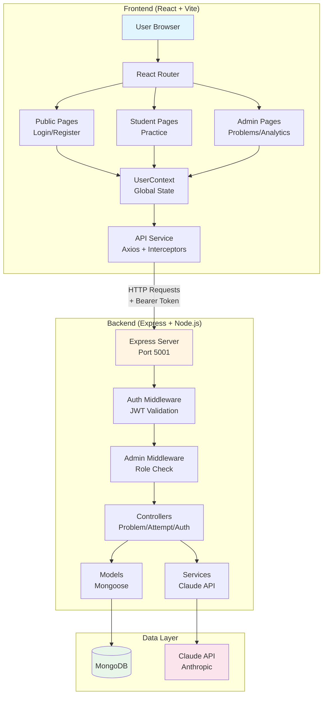
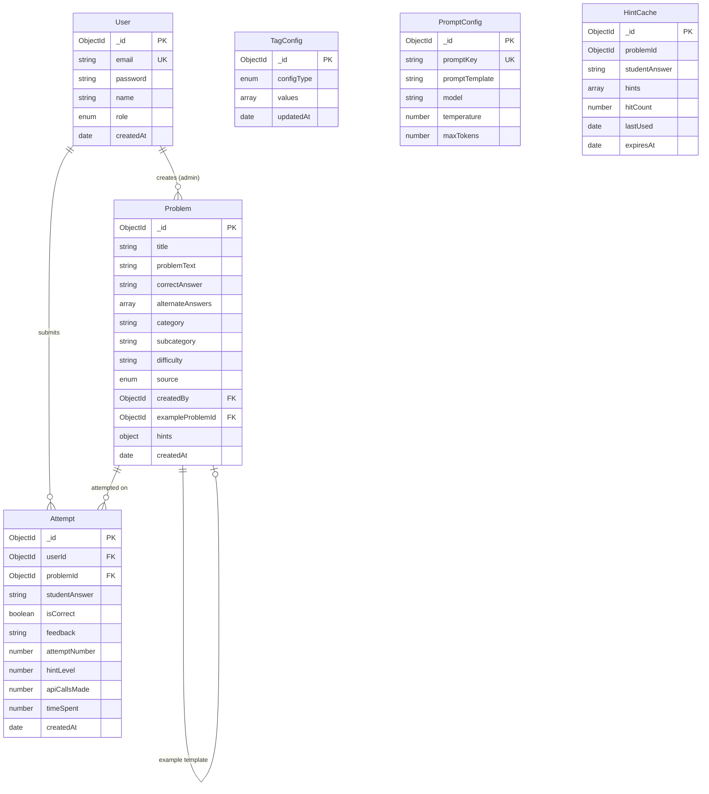
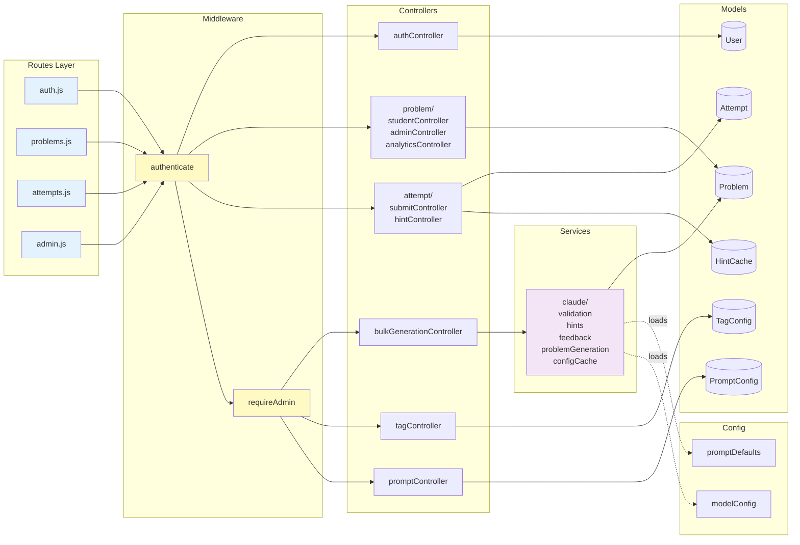
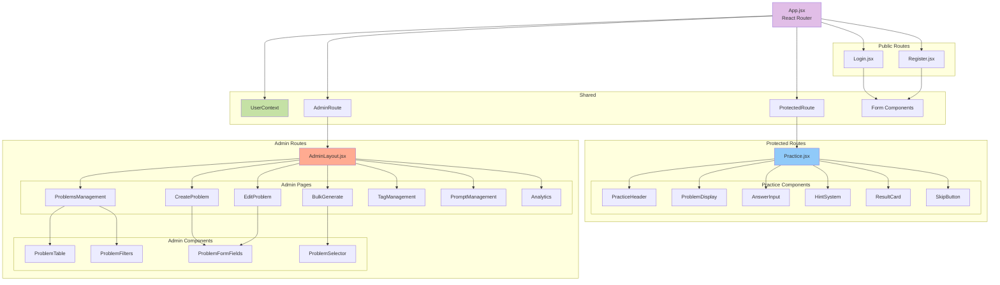
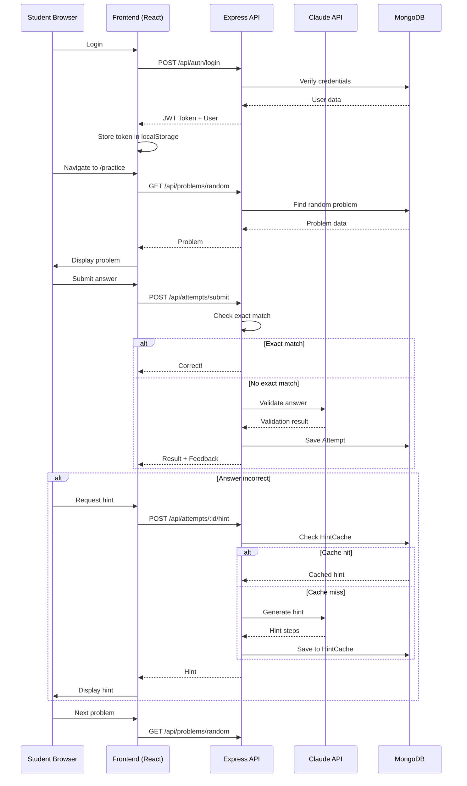
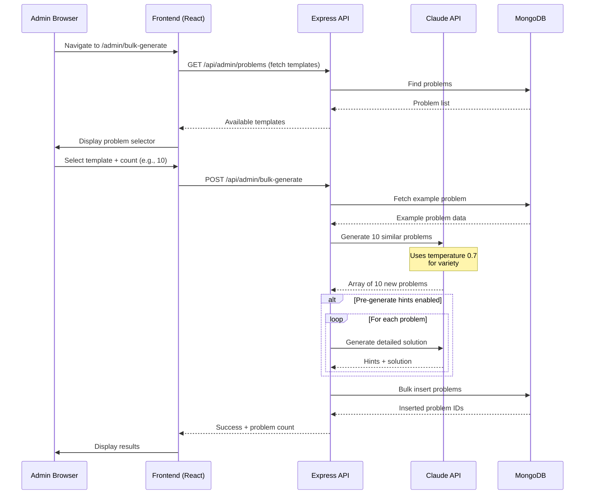

# MathApp - Codebase & Architecture Documentation

**Generated:** 2026-01-11
**Status:** Current (Post-Restructuring)

---

## 📋 Project Overview

MathApp is a full-stack MERN application for AI-powered math practice. It uses a **pre-generated problem bank architecture** where admins create and manage problems using Claude API for bulk generation, and students practice from the database.

### Technology Stack

**Backend:**
- Node.js + Express 5.2.1
- MongoDB with Mongoose ODM
- Anthropic Claude API (3.5 Sonnet, 3 Haiku)
- JWT authentication (bcryptjs, jsonwebtoken)
- Port: 5001

**Frontend:**
- React 19.2.0 with Vite 7.2.4
- React Router 7.11.0
- Axios 1.13.2 for API calls
- Port: 5173

---

## 🏗️ System Architecture



---

## 🗄️ Backend Architecture

### Database Models



#### 1. **User** (`server/models/User.js`)
Authentication & role-based access control.

**Fields:**
- `email` - Unique identifier for login
- `password` - Hashed with bcryptjs (10 rounds)
- `name` - Display name
- `role` - Enum: 'student' (default) or 'admin'
- `createdAt` - Registration timestamp

**Methods:**
- `generateAuthToken()` - Creates JWT with 7-day expiration
- `comparePassword(candidatePassword)` - Validates login

#### 2. **Problem** (`server/models/Problem.js`)
Math problem bank with pre-generated hints.

**Content Fields:**
- `title` - Problem identifier
- `problemText` - Question statement
- `answerFormat` - Expected format (e.g., "decimal", "fraction")
- `correctAnswer` - Primary correct answer
- `alternateAnswers` - Array of acceptable alternatives

**Taxonomy Fields:**
- `category` - High-level topic (e.g., "Algebra")
- `subcategory` - Specific topic (e.g., "Linear Equations")
- `difficulty` - Difficulty level (e.g., "Easy", "Medium", "Hard")

**Metadata:**
- `source` - Enum: 'seed', 'admin-manual', 'admin-generated'
- `createdBy` - Reference to User (admin who created it)
- `exampleProblemId` - Reference to template (for bulk-generated problems)

**Hints Object:**
- `steps` - Array of progressive hint steps
- `solution` - Full detailed solution

#### 3. **Attempt** (`server/models/Attempt.js`)
Student submission tracking with analytics.

**Core Fields:**
- `userId` - Reference to User
- `problemId` - Reference to Problem
- `studentAnswer` - What the student submitted
- `isCorrect` - Boolean result
- `feedback` - Personalized feedback from Claude
- `attemptNumber` - Nth attempt on this problem by this student

**Metrics:**
- `hintLevel` - How many hints were used (0 = no hints)
- `apiCallsMade` - Number of Claude API calls for this attempt
- `timeSpent` - Time in milliseconds

**Static Methods:**
- `getProblemMetrics(problemId)` - Returns statistics for a problem
- `getStudentProblemStats(userId, problemId)` - Student-specific stats

#### 4. **TagConfig** (`server/models/TagConfig.js`)
Admin-editable taxonomies for problem classification.

**Fields:**
- `configType` - Enum: 'categories', 'subcategories', 'difficulties'
- `values` - Array of valid tag strings
- `updatedAt` - Last modification timestamp

**Validation:**
- Prevents deleting tags that are in use by existing problems

#### 5. **PromptConfig** (`server/models/PromptConfig.js`)
Customizable Claude API prompt templates.

**Fields:**
- `promptKey` - Unique identifier (e.g., 'validation', 'hint', 'feedback')
- `promptTemplate` - Template string with placeholders
- `model` - Claude model to use (e.g., 'claude-3-5-sonnet-20241022')
- `temperature` - Randomness (0.0 - 1.0)
- `maxTokens` - Response length limit

**Use Cases:**
- Validation prompts
- Hint generation prompts
- Feedback generation prompts
- Problem generation prompts

#### 6. **HintCache** (`server/models/HintCache.js`)
Caches dynamically-generated hints to reduce API costs.

**Fields:**
- `problemId` - Reference to Problem
- `studentAnswer` - The incorrect answer that prompted the hint
- `hints` - Array of generated hint steps
- `hitCount` - Number of times this cache entry was used
- `lastUsed` - Timestamp of last access
- `expiresAt` - TTL expiration (7 days)

**Indexes:**
- Composite index on `(problemId, studentAnswer)` for fast lookups
- TTL index on `expiresAt` for automatic cleanup

---

### Backend Module Structure



### Controllers (Modular Structure)

#### **Problem Controllers** (`/controllers/problem/`)

**studentController.js** - Student-facing operations
- `getRandom()` - Fetch random problem for practice
- `getById(id)` - Get specific problem details

**adminController.js** - Admin CRUD operations
- `createProblem()` - Manual problem creation
- `updateProblem(id)` - Edit existing problem
- `deleteProblem(id)` - Remove single problem
- `bulkDeleteProblems()` - Delete multiple problems
- `listProblems()` - Paginated problem list with filters

**analyticsController.js** - Statistics and data
- `getProblemAnalytics(id)` - Success rate, attempt count, etc.
- `seed()` - Initial database seeding

#### **Attempt Controllers** (`/controllers/attempt/`)

**submitController.js** - Answer validation
- `submitAnswer()` - Validates student answer using Claude API
  - Fast path: exact string match first
  - Fallback: Claude Haiku for semantic validation
  - Creates Attempt record
  - Returns feedback

**hintController.js** - Hint generation
- `getHint()` - Progressive hint system
  - Checks HintCache first
  - Generates via Claude API if cache miss
  - Saves to cache for future use
  - Returns next hint step or full solution

#### **Other Controllers**

**authController.js** - Authentication
- `register()` - Create new user account
- `login()` - Validate credentials, return JWT
- `getCurrentUser()` - Get logged-in user details

**bulkGenerationController.js** - Bulk problem creation
- `bulkGenerate()` - Generate N similar problems from template
  - Uses Claude API with temperature 0.7 for variety
  - Optionally pre-generates hints for each problem
  - Bulk inserts to database

**tagController.js** - Tag management
- `getTags(configType)` - Fetch available tags
- `addTag(configType, value)` - Add new tag
- `removeTag(configType, value)` - Delete tag (with validation)

**promptController.js** - Prompt customization
- `getPrompt(key)` - Fetch prompt template
- `updatePrompt(key)` - Modify prompt settings
- `resetPrompt(key)` - Restore default

---

### Services (`/services/claude/`)

Modular Claude API integration (8 modules):

#### **apiClient.js**
- Initializes Anthropic SDK with API key
- Provides error wrapper for API calls

#### **validation.js**
- `validateAnswer(problemId, studentAnswer)` - Answer validation
  - Step 1: Exact string match (fast path)
  - Step 2: Claude Haiku API call (semantic validation)
  - Returns: `{ isCorrect, feedback }`

#### **hints.js**
- `generateSteps(problem)` - Create progressive hint steps
- `generateDynamicHint(problem, studentAnswer)` - Context-aware hints
- `generateDetailedSolution(problem)` - Full step-by-step solution

#### **feedback.js**
- `generateFeedback(problem, studentAnswer, isCorrect)` - Personalized feedback
  - Positive reinforcement for correct answers
  - Constructive guidance for incorrect answers

#### **problemGeneration.js**
- `generateSimilarProblems(exampleProblem, count)` - Bulk generation
  - Input: Template problem, count (1-20)
  - Uses temperature 0.7 for variety
  - Returns: Array of new problem objects

#### **configCache.js**
- Caches PromptConfig from database
- TTL-based cache to reduce database queries

#### **promptUtils.js**
- `interpolatePrompt(template, variables)` - Replace placeholders in templates
  - Example: `{{problemText}}` → actual problem text

#### **index.js**
- Re-exports all functions for clean imports

---

### Configuration (`/config/`)

#### **promptDefaults.js**
Single source of truth for default Claude prompts.

**DEFAULT_PROMPT_CONFIGS:**
- `validation` - Answer validation prompt
- `hint` - Hint generation prompt
- `feedback` - Feedback generation prompt
- `generation` - Problem generation prompt
- `steps` - Step-by-step solution prompt

Each config includes:
- `promptTemplate` - Template string with placeholders
- `model` - Recommended Claude model
- `temperature` - Creativity setting
- `maxTokens` - Response length limit

#### **modelConfig.js**
- `VALID_MODELS` - Array of supported Claude models
- Model recommendations for different use cases
- Claude API constants

#### **db.js**
- MongoDB connection with retry logic
- Connection pooling configuration
- Error handling

---

### API Routes

#### **Public Routes**
- `POST /api/auth/register` - Create account
- `POST /api/auth/login` - Authenticate user

#### **Protected Routes** (require authentication)
- `GET /api/auth/me` - Get current user
- `GET /api/problems/random` - Random problem for practice
- `GET /api/problems/:id` - Specific problem details
- `POST /api/attempts/submit` - Submit answer for validation
- `POST /api/attempts/:problemId/hint` - Request hint

#### **Admin Routes** (require admin role)
- `GET /api/admin/problems` - List all problems (paginated)
- `POST /api/admin/problems` - Create new problem
- `PUT /api/admin/problems/:id` - Update problem
- `DELETE /api/admin/problems/:id` - Delete problem
- `POST /api/admin/problems/bulk-delete` - Delete multiple
- `GET /api/admin/problems/:id/analytics` - Problem statistics
- `POST /api/admin/bulk-generate` - Bulk generate problems
- `GET /api/admin/tags/:configType` - Get tags
- `POST /api/admin/tags/:configType` - Add tag
- `DELETE /api/admin/tags/:configType/:value` - Remove tag
- `GET /api/admin/prompts/:key` - Get prompt template
- `PUT /api/admin/prompts/:key` - Update prompt template

---

### Utilities (`/utils/`)

#### **cache/** - Caching layer
- `memoryCache.js` - In-memory cache with TTL
- `hintCacheService.js` - HintCache database operations
- `index.js` - Unified cache interface

#### **Admin CLI Tools**
- `promoteToAdmin.js` - Promote user to admin role
- `listUsers.js` - Display all users
- `cleanupHintCache.js` - Remove expired cache entries
- `initializePromptConfigs.js` - One-time setup for prompts
- `initializeTagConfig.js` - One-time setup for tags

#### **Other Utilities**
- `analytics.js` - Problem and student metrics
- `responseHelpers.js` - Standardized API responses
- `problemData.js` - Seed problem data
- `seedProblemsWithHints.js` - Bulk seed with pre-generated hints

---

## 💻 Frontend Architecture

### Component Hierarchy



### Pages (`/pages/`)

#### **Public Pages**
- **Login.jsx** - User authentication form
  - Uses shared form components
  - Calls `auth.login()` service
  - Updates UserContext on success

- **Register.jsx** - Account creation form
  - Uses shared form components
  - Calls `auth.register()` service
  - Auto-login after registration

#### **Student Pages**
- **Practice.jsx** - Main practice interface (127 lines after refactor)
  - Fetches random problems
  - Manages answer submission
  - Progressive hint system
  - Skip to next problem
  - Uses custom `useProblem` hook

#### **Admin Pages** (`/pages/admin/`)

**AdminLayout.jsx** - Sidebar navigation shell
- Persistent sidebar with navigation links
- Outlet for nested routes

**ProblemsManagement.jsx** - Problem list management
- Paginated table of all problems
- Search and filter controls
- Multi-select for bulk operations
- Edit/delete actions
- Uses hooks: `usePagination`, `useSelection`

**CreateProblem.jsx** - Manual problem creation
- Form with all problem fields
- Tag dropdowns (categories, subcategories, difficulties)
- Alternate answers management
- Optional hint pre-generation
- Uses hooks: `useTags`, `useProblemForm`

**EditProblem.jsx** - Update existing problems
- Pre-populates form with existing data
- Same fields as CreateProblem
- Uses shared `ProblemFormFields` component

**BulkGenerate.jsx** - Template-based bulk generation
- Select example problem from dropdown
- Specify count (1-20)
- Option to pre-generate hints
- Progress indicator during generation
- Result display with success/failure counts

**TagManagement.jsx** - Taxonomy management
- Add/remove categories, subcategories, difficulties
- Validation prevents deleting in-use tags
- Real-time tag list updates

**PromptManagement.jsx** - Claude prompt customization
- Edit prompt templates
- Adjust model, temperature, maxTokens
- Reset to defaults
- Preview prompt with interpolation

**Analytics.jsx** - Problem statistics dashboard
- Per-problem success rates
- Attempt counts
- Average time spent
- Hint usage statistics

---

### Components

#### **Route Protection**
- **ProtectedRoute.jsx** - Checks authentication
  - Redirects to /login if no token

- **AdminRoute.jsx** - Checks admin role
  - Fetches user from UserContext
  - Redirects to /practice if not admin

#### **Form Components** (`/components/forms/`)
Reusable form elements with consistent styling:
- `FormCard.jsx` - Centered card container
- `FormInput.jsx` - Input with label and error display
- `FormButton.jsx` - Submit button with loading state
- `ErrorAlert.jsx` - Server error message display

#### **Practice Components** (`/components/practice/`)
- **ProblemDisplay.jsx** - Displays problem text with formatting
- **AnswerInput.jsx** - Input for student answers
- **HintSystem.jsx** - Progressive hint reveal
  - Shows steps one at a time
  - "Show Solution" button reveals full answer
- **PracticeHeader.jsx** - User info and logout button
- **ResultCard.jsx** - Correct/incorrect feedback display
- **SkipButton.jsx** - Move to next problem

#### **Admin Components** (`/pages/admin/components/`)

**Table Components:**
- `ProblemTable.jsx` - Sortable table with selection checkboxes
- `ProblemFilters.jsx` - Search and filter controls (category, difficulty, etc.)
- `Pagination.jsx` - Reusable pagination with page size selector

**Form Components:**
- `ProblemFormFields.jsx` - Shared fields for create/edit forms
- `AlternateAnswersField.jsx` - Dynamic array input for alternate answers

**Bulk Generation Components:**
- `ProblemSelector.jsx` - Dropdown to select template problem
- `GenerationProgress.jsx` - Progress bar during generation
- `GenerationResult.jsx` - Success/failure display after generation

---

### Custom Hooks (`/hooks/`)

#### **useProblem.js**
Problem fetching and submission logic for Practice page.

**State:**
- Current problem
- Student answer
- Submission result
- Hint data
- Loading states

**Methods:**
- `fetchRandomProblem()` - Get new problem
- `submitAnswer()` - Validate answer
- `requestHint()` - Get next hint step
- `skipProblem()` - Move to next

#### **useProblemForm.js**
Form state management for create/edit problem forms.

**State:**
- All form fields (title, problemText, category, etc.)
- Validation errors
- Submission loading state

**Methods:**
- `handleChange(field, value)` - Update field
- `handleSubmit()` - Validate and submit
- `resetForm()` - Clear all fields

#### **usePagination.js**
Pagination state for tables.

**State:**
- Current page
- Page size
- Total items

**Methods:**
- `nextPage()`, `prevPage()`, `goToPage(n)`
- `setPageSize(size)`

#### **useSelection.js**
Multi-select functionality for tables.

**State:**
- Selected item IDs
- Select all state

**Methods:**
- `toggleSelection(id)` - Toggle single item
- `toggleSelectAll()` - Select/deselect all
- `clearSelection()` - Reset

#### **useTags.js**
Tag fetching and caching.

**State:**
- Categories, subcategories, difficulties
- Loading state

**Methods:**
- `fetchTags(configType)` - Load from API
- `refreshTags()` - Force reload

---

### Context (`/contexts/`)

#### **UserContext.jsx**
Global user state management using React Context.

**Provides:**
- `user` - Current user object (includes role)
- `setUser` - Update user state
- `loading` - Initial load state
- `logout` - Clear user state

**Initialization:**
- On app mount, calls `/api/auth/me`
- If token exists, fetches user data
- Updates context with user + role

**Used By:**
- AdminRoute (checks user.role)
- PracticeHeader (displays user name)
- All pages needing auth state

---

### Services (`/services/`)

#### **api.js**
Axios instance with interceptors.

**Base Configuration:**
- Base URL: `http://localhost:5001/api` (or from env)
- Timeout: 10 seconds

**Request Interceptor:**
- Reads token from localStorage['authToken']
- Adds `Authorization: Bearer <token>` header automatically

**Response Interceptor:**
- Transforms response data
- Handles 401/403 errors → auto-logout and redirect to /login

#### **auth.js**
Authentication operations.

**Functions:**
- `login(email, password)` - Returns { user, token }
- `register(email, password, name)` - Returns { user, token }
- `getCurrentUser()` - Returns user object
- `logout()` - Clears localStorage['authToken']
- `getToken()` - Retrieves stored token
- `setToken(token)` - Stores token in localStorage

#### **admin.js**
Admin API operations.

**Problem CRUD:**
- `getProblems(filters, page, limit)` - Paginated list
- `getProblemById(id)` - Single problem
- `createProblem(data)` - Create new
- `updateProblem(id, data)` - Update existing
- `deleteProblem(id)` - Delete single
- `bulkDeleteProblems(ids)` - Delete multiple

**Bulk Generation:**
- `bulkGenerate(exampleId, count, options)` - Generate similar problems

**Tag Management:**
- `getTags(configType)` - Fetch tags
- `addTag(configType, value)` - Add tag
- `removeTag(configType, value)` - Delete tag

**Prompt Management:**
- `getPrompt(key)` - Fetch template
- `updatePrompt(key, data)` - Update template

---

### Routing Structure

From [App.jsx](client/src/App.jsx):

```
/ → Login
/register → Register
/practice → Practice (ProtectedRoute)
/admin → AdminLayout (AdminRoute)
  ├─ /admin/problems → ProblemsManagement
  ├─ /admin/problems/new → CreateProblem
  ├─ /admin/problems/:id/edit → EditProblem
  ├─ /admin/bulk-generate → BulkGenerate
  ├─ /admin/tags → TagManagement
  ├─ /admin/prompts → PromptManagement
  └─ /admin/analytics → Analytics
```

---

## 🔄 Key Workflows

### 1. Student Practice Workflow



**Steps:**
1. Student logs in → JWT stored in localStorage
2. Practice page loads
3. Fetch random problem (GET /api/problems/random)
4. Submit answer (POST /api/attempts/submit)
5. Claude validates answer (or exact match)
6. If incorrect: Request hint (POST /api/attempts/:id/hint)
7. HintCache checked → Claude API if miss → Cache result
8. Progressive hints: Step 1 → Step 2 → ... → Full solution
9. Next problem

---

### 2. Admin Bulk Generation Workflow



**Steps:**
1. Admin creates manual problem (or uses existing)
2. Navigate to /admin/bulk-generate
3. Select example problem as template
4. Specify count (1-20) and options
5. Claude API generates N similar problems (temperature 0.7)
6. Optional: Pre-generate hints/solutions for each
7. Bulk insert to database
8. Problems available for student practice

---

### 3. Authentication Flow

```
Register/Login
    ↓
Backend validates credentials
    ↓
Generate JWT (7-day expiration, includes role)
    ↓
Frontend stores in localStorage['authToken']
    ↓
Axios interceptor adds "Authorization: Bearer <token>" to all requests
    ↓
Backend auth middleware validates JWT
    ↓
User object attached to req.user
    ↓
Admin middleware checks req.user.role === 'admin'
```

**UserContext Flow:**
1. App initializes → UserContext provider wraps routes
2. On mount, calls `/api/auth/me` if token exists
3. Fetches user data including role
4. Stores in context state
5. AdminRoute checks `user.role === 'admin'`
6. Redirects non-admins to /practice

---

## 🔧 Configuration & Environment

### Backend Environment Variables (`server/.env`)

```env
MONGODB_URI=mongodb://localhost:27017/mathapp
JWT_SECRET=your-secret-key-here
PORT=5001
CLAUDE_API_KEY=sk-ant-...
NODE_ENV=development
```

### Frontend Environment Variables (`client/.env`)

```env
VITE_API_URL=http://localhost:5001
```

---

## 🚀 Development Workflow

### Starting the Application

**Backend:**
```bash
cd server
npm run dev  # Nodemon auto-restart
```

**Frontend:**
```bash
cd client
npm run dev  # Vite dev server on port 5173
```

### Admin Setup

1. Register user through UI
2. Promote to admin:
   ```bash
   node server/utils/promoteToAdmin.js user@example.com
   ```
3. Log out and back in (JWT needs regeneration)
4. Access `/admin` portal

### Database Seeding

On first startup in development mode:
- Server auto-seeds if Problem collection is empty
- Uses `server/utils/seedProblemsWithHints.js`
- Pre-generates solutions via Claude API

---

## 📊 Code Organization Principles

✅ **Modular Controllers** - Separated by user type (student/admin) and concern (analytics)
✅ **Service Layer** - Business logic isolated from routes
✅ **Config-Driven** - Prompts and models stored in database, not hardcoded
✅ **Layered Caching** - HintCache prevents redundant API calls
✅ **DRY Components** - Reusable forms, hooks, and UI elements
✅ **Role-Based Access** - JWT-based authentication with admin middleware
✅ **Single Source of Truth** - Centralized configs eliminate duplication

---

## 📈 Key Metrics (Post-Restructuring)

**Lines of Code Eliminated:** ~2,335+ lines
**Modules Created:** 44 new focused files
**Files Modified:** 15 files refactored
**Backend Controllers:** Split from 3 large files → 9 focused modules
**Frontend Components:** 20+ reusable components
**Custom Hooks:** 6 hooks for shared logic
**API Endpoints:** 15+ routes across 4 route files

**Notable Reductions:**
- `claudeService.js`: 448 → 20 lines (+ 8 modules)
- `problemController.js`: 418 → 15 lines (+ 4 modules)
- `Practice.jsx`: 330 → 127 lines (62% reduction)
- `CreateProblem.jsx`: 272 → 84 lines (69% reduction)

---

## 🧪 Testing Checklist

### Backend Testing
```bash
cd server && npm run dev
```

Test endpoints:
- ✅ `GET /api/problems/random` - Student problem fetch
- ✅ `POST /api/attempts/submit` - Answer submission
- ✅ `POST /api/attempts/:id/hint` - Hint generation
- ✅ `POST /api/admin/bulk-generate` - Bulk generation (admin)

### Frontend Testing
```bash
cd client && npm run dev
cd client && npm run lint
cd client && npm run build
```

### Integration Testing

**Student Flow:**
1. Register new user
2. Login
3. Practice: fetch problem → submit answer → request hint → view solution
4. Skip to next problem

**Admin Flow:**
1. Promote to admin: `node server/utils/promoteToAdmin.js <email>`
2. Log out/back in
3. Admin: Create problem manually
4. Admin: Bulk generate problems
5. Admin: Edit/delete problems
6. Admin: View analytics

---

## 📚 Additional Documentation

- [CLAUDE.md](CLAUDE.md) - Development guide for Claude Code
- [RESTRUCTURING_SUMMARY.md](RESTRUCTURING_SUMMARY.md) - Restructuring completion report
- [README.md](README.md) - Project overview and setup

---

**This architecture documentation is current as of 2026-01-11 following the comprehensive code restructuring.**
